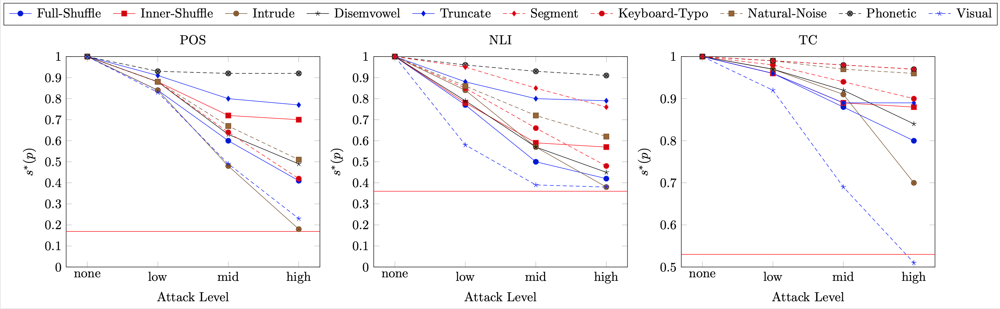
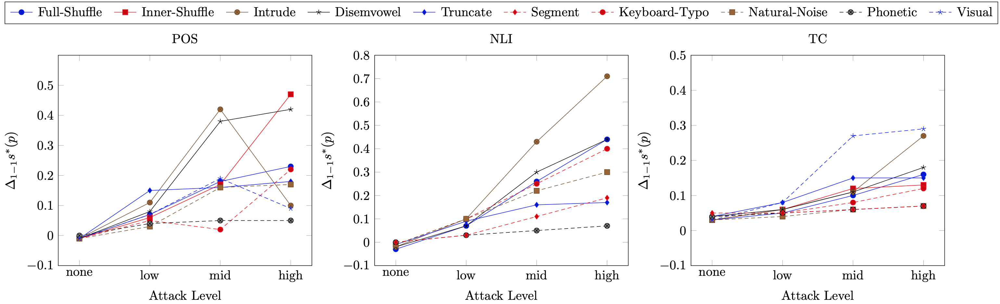
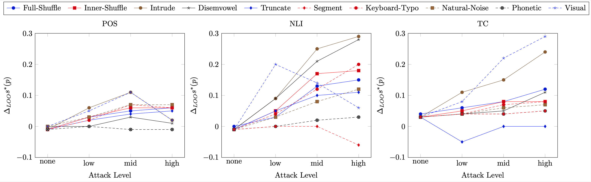

# From Hero to Zéroe: A Benchmark of Low-Level Adversarial Attacks

This repository provides code and data for the paper [From Hero to Zéroe: A Benchmark of Low-Level Adversarial Attacks](https://arxiv.org/abs/2010.05648)

## Citation

````
@inproceedings{eger2020hero,
      title={From Hero to Z\'eroe: A Benchmark of Low-Level Adversarial Attacks}, 
      author={Steffen Eger and Yannik Benz},
      year={2020},
      booktitle={AACL},
      publisher = "Association for Computational Linguistics",
}
````


## Experiments:

### Model:
RoBERTa

### Perturbers:
* full-shuffle
* inner-shuffle
* intruders
* disemvoweling
* truncate
* segmentation
* keyboard-typos
* natural-typos
* phonetic
* visual

### Tasks (Datasets):
* POS tagging (Universal Dependencies)
* Natural Language Inference (SNLI)
* Toxic Comment Classification (kaggle challenge)

### Hyperparameters:
Key | Value
--- | ---
Batch Size | 28
Epochs | 3
Sequence Length | 256

### Results:
#### RoBERTas' performance attacked by **Zéroe**


#### Adversarial Training


#### Adversarial Training (leave-one-out)


## 1. Requirements

We use conda to setup our python environment.

We freezed our environment into the [environment.yml](environment.yml) file 
([further docs](https://docs.conda.io/projects/conda/en/latest/user-guide/tasks/manage-environments.html#creating-an-environment-from-an-environment-yml-file)).

Restore it with the following command:

`conda env create -f environment.yml`

The fact that some packages are not available in the conda repository makes 
it necessary to install them manually:

`pip install transformers==2.5.1`
`pip install seqeval==0.0.12`

The full requirements are given in the [requirements.txt](requirements.txt)
You can also install them via:
`pip install -r requirements.txt`

````
conda install numpy pandas scitkit-learn nltk torch fastprogress absl tqdm
conda install -c fastai fastprogress
conda install tensorflow-gpu==2.0.0  (if GPU is available else: `tensorflow==2.0.0`)  
pip install transformers==2.5.1
pip install seqeval==0.0.12
````

## 2. code/models
contains the models being used in this work

### G2PP2G

[g2pp2g.py](code/models/g2pp2g.py) contains the model(s) to generate the phonetic perturbations.
Pretrained models used to generate the phonetic perturbations can be found in models/g2p and models/p2g.
These pretrained models are automatically preloaded if the TRAIN flags aren't specified.
Therefore to retrain the models you need to enable those flags in the source code.


## 3. data

In order to perturb the data we preprocessed each tasks dataset by all our 10 perturbers
and stored them to `data/task/{mode}_{perturber}_{level}.txt`, e.g. data/datasets/tc/train_phonetic_high.txt
This naming scheme is important so run the experiments seamlessly.

To generate this data run:
````
python gen_datasets.py 
--task {task}
--methods {attackers}
--level {attack level}
--indir {path_to_raw_data}
````

e.g. to generate the perturbed data for SNLI with all attackers on perturbation level low run:
````
python gen_datasets.py 
--task snli
--methods all
--level low
--indir ./data
````

## 4. Run roberta train/eval/predict (experiments)

The following describes how to train/evaluate/predict RoBERTa
This behavior is the same for all three tasks, you just need to replace the run_task.py file

For detailed description about the command line flags consult the respective python file (e.g. run_tc.py).

### Training
```` shell script
python run_tc.py  
--data_dir="data/datasets/tc"
--model_type=roberta  
--model_name_or_path=roberta-base  
--output_dir="models/RoBERTa/tc"  
--max_seq_length=256  
--num_train_epochs=3  
--per_device_train_batch_size=28  
--seed=1  
--do_train
````

### Evaluation
```` shell script
python run_tc.py
--data_dir="data/datasets/tc" 
--model_type=roberta 
--model_name_or_path=roberta-base 
--output_dir="models/RoBERTa/tc" 
--max_seq_length=256
--do_eval
````

### Prediction
```` shell script
python run_tc.py
--data_dir="data/datasets/tc" 
--model_type=roberta 
--model_name_or_path=roberta-base 
--output_dir="models/RoBERTa/tc" 
--max_seq_length=256
--do_eval
````

## Defense Mechanisms

### Adversarial Training (e.g. with full-swap)
```` shell script
python run_tc.py  
--data_dir="data/datasets/tc"
--model_type=roberta  
--model_name_or_path=roberta-base  
--output_dir="models/RoBERTa/at/1-1/tc"  
--max_seq_length=256  
--num_train_epochs=3  
--per_device_train_batch_size=28  
--seed=1  
--do_train
--full-swap
--lmh
````

### Adversarial Training Leave-One-Out (e.g. with full-swap)
```` shell script
python run_tc.py  
--data_dir="data/datasets/tc"
--model_type=roberta  
--model_name_or_path=roberta-base  
--output_dir="models/RoBERTa/at/loo/tc"  
--max_seq_length=256  
--num_train_epochs=3  
--per_device_train_batch_size=28  
--seed=1  
--do_train
--perturber=no-full-swap
--level=lmh
````

